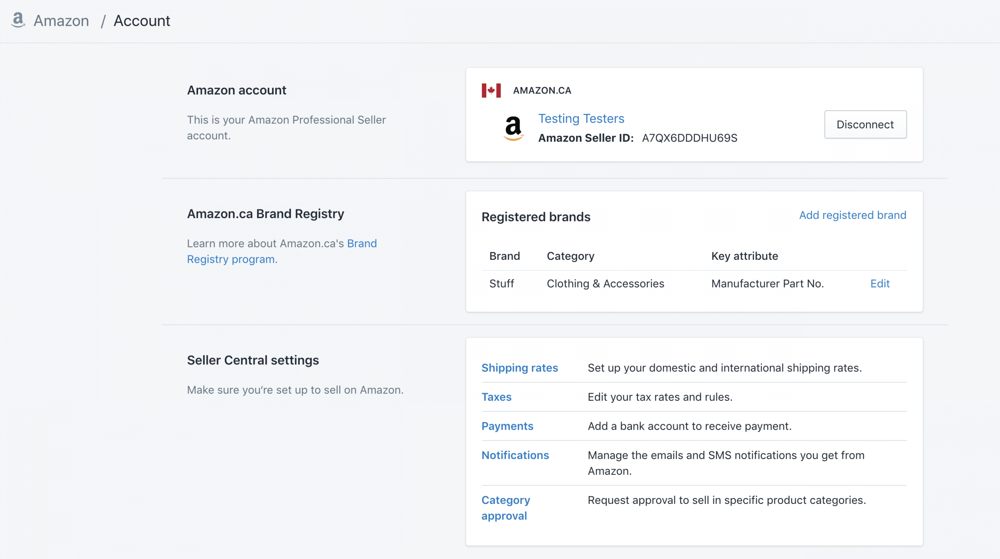
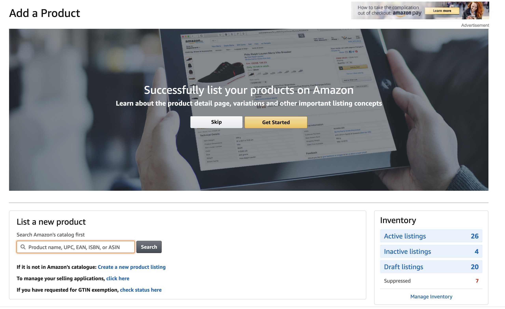

@snap[north span-100]

@snapend

@snap[west span-30]

### The best place on Earth

@snapend

---

@snap[midpoint span-65]

@quote[It's not an experiment if you know it's going to work. - Jeff Bezos]
@snapend

---

@snap[midpoint span-65]


@snapend

---



---

@snap[north-west]

#### What's an ASIN?

@snapend

@snap[midpoint span-60]
@ul[spaced]

- UPC
  - US barcode for retail packaging
- EAN
  - European bar code standard
- ISBN
  - International book specific barcode
- ASIN
  - For books, ASIN is the same as ISBN
  - ASIN is created when an item is added to the Amazon catalog
  - Merchants can either add an ASIN of an existing item in Amazon's catalog OR when they add a never-before-listed item, a new ASIN is created for them.

@ulend
@snapend

---

```
package main

import "fmt"

func main() {
    fmt.Println("Hello, world!")
}
```

@[1]
@[3-8]
@title[Code]

---

## Add Some Slide Candy


---

@title[Customize Slide Layout]

@snap[west span-50]

## Customize Slide Content Layout

@snapend

@snap[east span-50]

@snapend

---?color=#E58537
@title[Add A Little Imagination]

@snap[north-west]

#### Add a splash of @color[cyan](**color**) and you are ready to start presenting...

@snapend

@snap[west span-55]
@ul[spaced text-white]

- You will be amazed
- What you can achieve
- _With a little imagination..._
- And **GitPitch Markdown**
  @ulend
  @snapend

@snap[east span-45]
@img[shadow](assets/img/conference.png)
@snapend

---?image=assets/img/presenter.jpg

@snap[north span-100 headline]

## Now It's Your Turn

@snapend

@snap[south span-100 text-06]Click here to jump straight into the interactive feature guides in the GitPitch Docs @fa[external-link]](https://gitpitch.com/docs/getting-started/tutorial/)
@snapend
