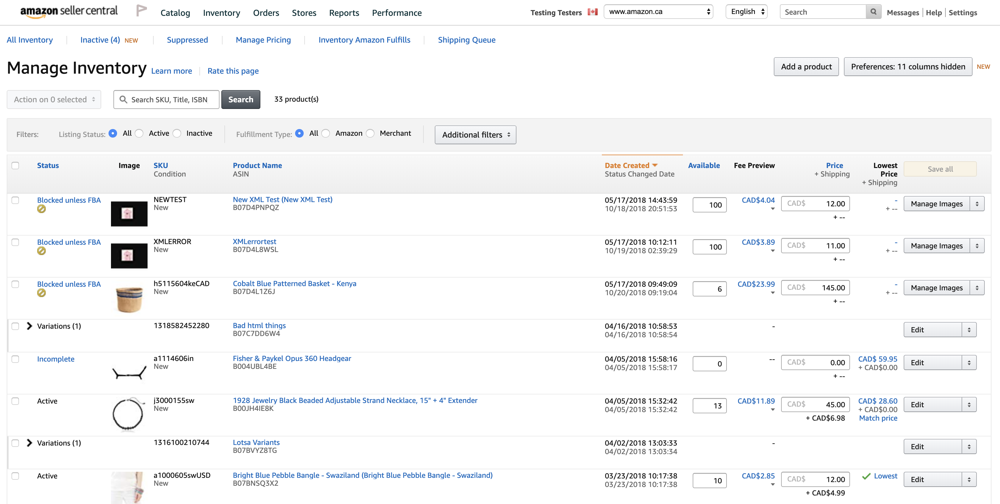

@snap[north span-100]

@snapend

@snap[west span-30]

### The best place on Earth

@snapend

---

@snap[midpoint span-65]

@quote[It's not an experiment if you know it's going to work. - Jeff Bezos]
@snapend

---

@snap[midpoint span-65]


@snapend

---


---

@snap[north-west]

#### Amazon's Catalog

@snapend

@snap[west span-100]
@ul[spaced]

- UPC
  - US barcode for retail packaging
- EAN
  - European bar code standard
- ISBN
  - International book specific barcode

@ulend

---

### What's an ASIN?

@ul

- A new ASIN is created when an item is added to the Amazon catalog
- When merchants add an existing item (Colgate toothpaste?), the existing ASIN is used
- When merchants add a never-before-listed item, a new ASIN is created for them
- For books, ASIN is the same as ISBN (super fun fact)

@ulend

---



---

```ruby
module Clockwork

...
  every(1.minute, "Fetch and process inventory reports") { FetchInventoryReportJob.perform_async }
  every(1.minute, "Group inventory report lines") { GroupInventoryReportLinesJob.perform_async }
...

end
```

@[4]
@[5]

---

```ruby
module ShopJob
  class FetchInventoryReportJob < MwsBase

  # We ask Amazon to get a report ready and only after ~minutes can we fetch it

  AmazonInventoryReportManager.new(shop).request_report # first

  # next time the job runs:

  AmazonInventoryReportManager.new(shop).fetch_report # after some time

  end
end
```

---

```csv
# inventory report CSV

sku	asin	price	quantity
SKU-222	B01ASC09LE	1000.00	40
SKU-444	B01ASC10LE	100.00	54
```

---

```ruby
def fetch_report

  # create instances of inventory_report_lines for each line in CSV
  process_report

  # if any existing inventory_report_lines aren't in the report, delete them.
  delete_unreported_lines

  # sets offer.in_inventory_report = true for offers with matching skews
  # sets offer.in_inventory_report = false for offers with no matching skews
  # marks human status of offers not in inventory report as stale (will discuss l8r)
  update_offers

  # clear inventory report request ID
  discard_report
end

```

@[4]
@[7]
@[10]

---

```ruby
# inventory_report_lines

create_table "inventory_report_lines", force: :cascade, options: "ENGINE=InnoDB DEFAULT CHARSET=utf8mb4 COLLATE=utf8mb4_unicode_ci" do |t|
  t.integer "shop_id", null: false
  t.integer "offer_id"
  t.string "asin", limit: 25, null: false
  t.string "parent_asin", limit: 25
  t.string "price", limit: 20
  t.string "quantity", limit: 20
  t.string "seller_sku", limit: 40, null: false
  ...
end

```

@[3]
@[4]
@[6-7]
@[10]
@title[Inventory Report Lines]

---

## Add Some Slide Candy


---

@title[Customize Slide Layout]

@snap[west span-50]

## Customize Slide Content Layout

@snapend

@snap[east span-50]

@snapend

---?color=#E58537
@title[Add A Little Imagination]

@snap[north-west]

#### Add a splash of @color[cyan](**color**) and you are ready to start presenting...

@snapend

@snap[west span-55]
@ul[spaced text-white]

- You will be amazed
- What you can achieve
- _With a little imagination..._
- And **GitPitch Markdown**
  @ulend
  @snapend

@snap[east span-45]
@img[shadow](assets/img/conference.png)
@snapend

---?image=assets/img/presenter.jpg

@snap[north span-100 headline]

## Now It's Your Turn

@snapend

@snap[south span-100 text-06]Click here to jump straight into the interactive feature guides in the GitPitch Docs @fa[external-link]](https://gitpitch.com/docs/getting-started/tutorial/)
@snapend
